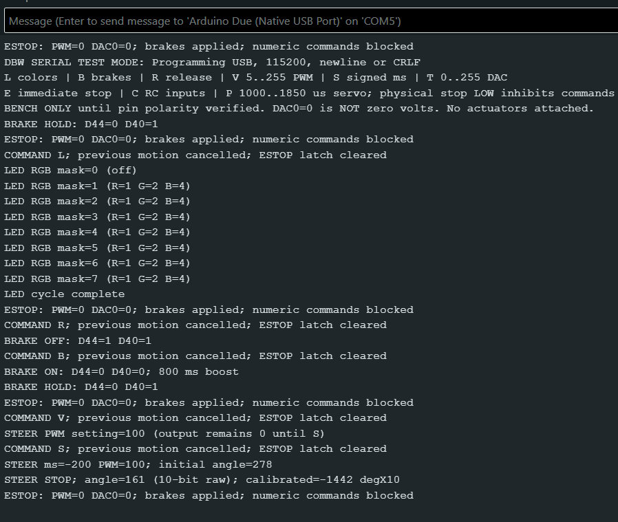

# Add interactive DBW actuator tests via Serial Monitor

## Purpose

This adds the interactive hardware tests requested by Professor Folsom. Using
Serial Monitor, an operator can test the LEDs, brakes, steering, throttle, and
RC inputs individually to help diagnose wiring, sensor, and actuator problems.

Tests run within the existing DBW sketch, with normal driving control disabled
during testing. Test mode is **off by default**. An optional PowerShell runner
automatically checks the LED, brake, and steering serial responses.

## How to use it

Start with a **bare Due powered by USB only**, without a motor shield or actuators.

1. Open [Drive_By_Wire/Drive_By_Wire.ino](../Drive_By_Wire/Drive_By_Wire.ino) in Arduino IDE.
2. Temporarily set `DBW_SERIAL_TEST_MODE` to `1` in [Drive_By_Wire/FirmwareMode.h](../Drive_By_Wire/FirmwareMode.h).
3. Select **Arduino Due (Programming Port)** and the board's port, then upload.
4. Restore the source setting to `0` before submitting changes. Do not upload again
   if continuing diagnostics; editing the source does not change the running Due.

### Manual tests

Open Serial Monitor at **115200 baud** with **Newline** enabled. Send one command
at a time and wait for the response before continuing.

| Command | What it does |
| --- | --- |
| `L` | Cycle off and seven LED colors, one second each |
| `R`, then `B` | Release brakes, then apply them with 800 ms boost followed by holding voltage |
| `V 100`, then `S -200` | Store steering drive level 100, then command leftward steering for 200 ms and report the sensor |
| `E` | Stop steering, zero throttle code, and command brakes on |
| `T 0..255` | Set throttle output; nonzero values require brakes released |
| `C` | Report pulse widths from all six RC channels |
| `P 1000..1850` | Test servo steering pulses within the configured limits |

`S` specifies **direction and time, not a target angle**. `V` alone does not move
the steering. Steering runs are limited to one second; nonzero throttle and servo
outputs expire after five seconds. Startup commands brakes on. A valid letter
after `E` clears the software stop latch but does not automatically release brakes.

The steering example above is for the bare board, not an initial real-motor test.

### Manual Serial Monitor Demo

The screenshot shows the manual sequence `E`, `L`, `E`, `R`, `B`, `E`, `V 100`,
`S -200`, `E`, with each command sent separately after the preceding response.



The LED cycle completes, the brakes report release then boost/hold, and steering
reports a stop followed by the final E-stop acknowledgement. These are firmware
responses, not automated PASS/FAIL results. On the bare Due, sensor values such as
`278 -> 161` come from an unconnected input and do not demonstrate movement.

### Automated tests

Close Serial Monitor to release the port. From the project folder in Windows
PowerShell, run (replace COM5 if needed):

```powershell
.\tests\serial_test_mode\run-serial.ps1 -Port COM5 -BareDueConfirmed
```

No reset is needed. The runner sends commands, checks each response and its
timing, and requests `E` after each sequence. It skips later tests if a test fails.
Use `-BareDueConfirmed` **only for the disconnected, USB-only setup**.

## Results and what they mean

The September 30, 2026 USB-only Due run passed all nine command checks. Complete
reported output:

```text
Connected to COM5 at 115200. Verifying diagnostic firmware with E-stop; no RESET needed.
TEST 01 [Diagnostic handshake]: E -- wait for ESTOP acknowledgement
PASS COMMAND 01 [Diagnostic handshake]: E -- Exact ESTOP reply received: PWM=0, DAC0=0, brakes applied, numeric commands blocked.
PASS: Diagnostic handshake
   SATISFIED: E returned the exact required reply: ESTOP: PWM=0 DAC0=0; brakes applied; numeric commands blocked
TEST 02 [LED sequence]: L -- wait for LED cycle complete (about 8 seconds)
PASS COMMAND 02 [LED sequence]: L -- Masks 0..7 in order, LED cycle complete; host intervals 994.5, 999.5, 999.5, 1003.2, 999.4, 999.6, 999.4, 999.9 ms, all within 650..1500 ms.
TEST 03 [LED sequence]: E -- wait for ESTOP acknowledgement
PASS COMMAND 03 [LED sequence]: E -- Exact ESTOP reply received: PWM=0, DAC0=0, brakes applied, numeric commands blocked.
PASS: LED sequence
   SATISFIED: Reported LED masks: 0, 1, 2, 3, 4, 5, 6, 7, in the required order.
   SATISFIED: Received LED cycle complete after mask 7.
   SATISFIED: Host intervals: 994.5, 999.5, 999.5, 1003.2, 999.4, 999.6, 999.4, 999.9 ms; all 8 within 650..1500 ms.
   SATISFIED: Cleanup E returned the exact diagnostic E-stop acknowledgement.
TEST 04 [Brake sequence]: R -- wait for BRAKE OFF
PASS COMMAND 04 [Brake sequence]: R -- BRAKE OFF received: D44=1, D40=1; equal released relay levels.
TEST 05 [Brake sequence]: B -- wait for BRAKE HOLD (about 800 ms)
PASS COMMAND 05 [Brake sequence]: B -- BRAKE ON D44=0, D40=0 -> BRAKE HOLD D44=0, D40=1; expected relay transitions; 794.7 ms within 600..1200 ms (host timing).
TEST 06 [Brake sequence]: E -- wait for ESTOP acknowledgement
PASS COMMAND 06 [Brake sequence]: E -- Exact ESTOP reply received: PWM=0, DAC0=0, brakes applied, numeric commands blocked.
PASS: Brake sequence
   SATISFIED: Reported release: D44=1, D40=1; both at the same released level.
   SATISFIED: Reported boost: D44=0, D40=0; both inverted from release.
   SATISFIED: Reported hold: D44=0, D40=1; brake stayed applied, voltage select returned to release level.
   SATISFIED: Boost interval: 794.7 ms; allowed 600..1200 ms (host receipt timing).
   SATISFIED: Cleanup E returned the exact diagnostic E-stop acknowledgement.
TEST 07 [Timed steering]: V 100 -- wait for STEER PWM setting=100
PASS COMMAND 07 [Timed steering]: V 100 -- STEER PWM setting=100 received, matching the requested setting; firmware reports output remains zero until S.
TEST 08 [Timed steering]: S -200 -- wait for STEER STOP (about 200 ms)
PASS COMMAND 08 [Timed steering]: S -200 -- Reported ms=-200 and PWM=100; raw sensor 438 -> 244 within 0..1023; STEER STOP after 196.6 ms within 100..600 ms (host timing). Sensor accuracy NOT TESTED.
TEST 09 [Timed steering]: E -- wait for ESTOP acknowledgement
PASS COMMAND 09 [Timed steering]: E -- Exact ESTOP reply received: PWM=0, DAC0=0, brakes applied, numeric commands blocked.
PASS: Timed steering
   SATISFIED: Received STEER PWM setting=100 acknowledgement.
   SATISFIED: Received STEER ms=-200 PWM=100, matching the requested direction, duration, and drive setting.
   SATISFIED: Raw sensor reports: 438 -> 244; both within 0..1023. Accuracy NOT TESTED.
   SATISFIED: Received STEER STOP after 196.6 ms; allowed 100..600 ms (host receipt timing).
   SATISFIED: Cleanup E returned the exact diagnostic E-stop acknowledgement.
Serial behavior: PASS
Electrical outputs: NOT TESTED
Physical actuators: NOT TESTED
```

- **TEST** shows the command being sent and the response expected.
- **PASS COMMAND** means that command's responses and checks matched expectations
  before the next command was sent. Here, the release and boost-to-hold reports
  were correct, and 794.7 ms was inside the allowed 600-1200 ms window.
- **PASS: Brake sequence** means the whole brake test, including its final stop
  acknowledgement, passed. **SATISFIED** lines explain the conditions checked.

| Test | Observed result |
| --- | --- |
| LED | All eight states in order, approximately one second each |
| Brakes | Expected release, boost, and hold reports; 794.7 ms boost interval |
| Steering | Drive level 100 and duration -200 acknowledged; stop report after 196.6 ms |
| Stop | Expected acknowledgement after every sequence |

**This confirms command handling and reported behavior, not physical operation.**
Times are measured as messages reach the computer and include USB delays. The
sensor reading `438 -> 244` came from an unconnected input; it does not show real
movement. Throttle, servo, RC, and physical-stop wiring still need hardware checks.
Both firmware build modes and the software regression tests also passed.

## Next steps on the trike

**Upload the diagnostic firmware to the Due on the real trike, open Serial
Monitor, and issue commands manually while observing the hardware.**

1. Set `DBW_SERIAL_TEST_MODE` to `1` and upload the DBW sketch to the trike's Due
   using **Arduino Due (Programming Port)** and its current COM port.
2. Open Serial Monitor at **115200 baud** with **Newline** enabled.
3. Send one command at a time, wait for completion, and compare the response with
   what actually happens on the trike. Startup commands the brakes on.
4. Use the manual checks below, not the bare-Due automated runner. End each test
   with `E`; test throttle only after brake and stop behavior are verified.

| Command | What to observe on the trike |
| --- | --- |
| `L` | The external RGB LED cycles through off, red, green, yellow, blue, magenta, cyan, and white, then turns off. |
| `R` | The brakes physically release; a relay click alone is not enough. |
| `B` | The brakes engage and remain engaged after the 800 ms boost period. |
| `S 0` | A raw steering-sensor reading appears without commanding movement. Check feedback at known positions with actuator power disabled. |
| `V` followed by the selected drive value | The setting is acknowledged; steering should not move yet. |
| `S` followed by a short signed duration | Steering moves briefly and stops driving. Check the actual direction and that sensor readings agree with the movement. Repeat with the opposite sign separately. |
| `E` | Steering drive and throttle demand stop, and brakes engage or remain engaged. Verify the actual response, not just the acknowledgement. |
| `R`, then `T` followed by a small validated value | The raised rear wheel responds to throttle. Check `T 0`, `E`, and the five-second timeout remove drive demand. |
| `C` (optional) | Moving each RC control changes the corresponding reported channel; missing signals report zero. |
| `P` followed by a validated pulse width (optional) | The connected steering servo responds and sensor feedback agrees. Verify its response when pulses stop after five seconds. |

A physical test passes only when the serial response **and the observed hardware
behavior** agree. For example: a short steering command produces movement, the
drive stops, and the sensor reports a corresponding change. Actual left/right
direction still needs verification; `S` specifies time, not a target angle.

Voltage and timing claims require measurements: seeing the brakes engage does not
confirm the intended 24 V boost to 12 V hold. Verify throttle voltage and idle
behavior before motor testing; DAC code zero is not zero volts.

Record observations and measurements separately from the automated serial PASS
results. Restore the source setting to `0` before submission; returning the Due
to normal operation requires a deliberate upload of the normal build. For the
full setup, precautions, and limits, see [Serial_Test_Mode.md](Serial_Test_Mode.md).